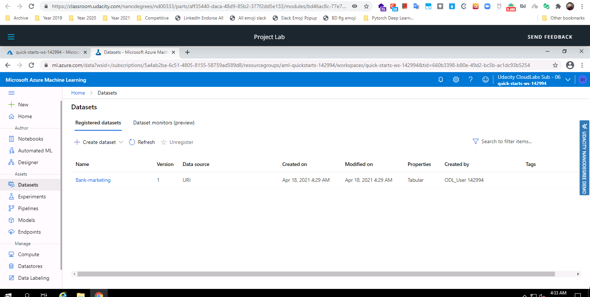
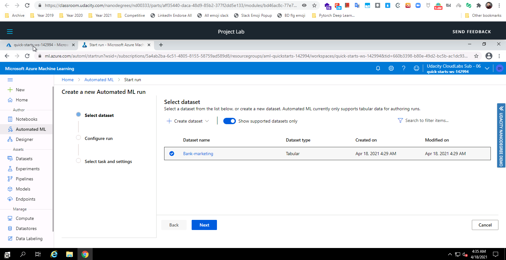
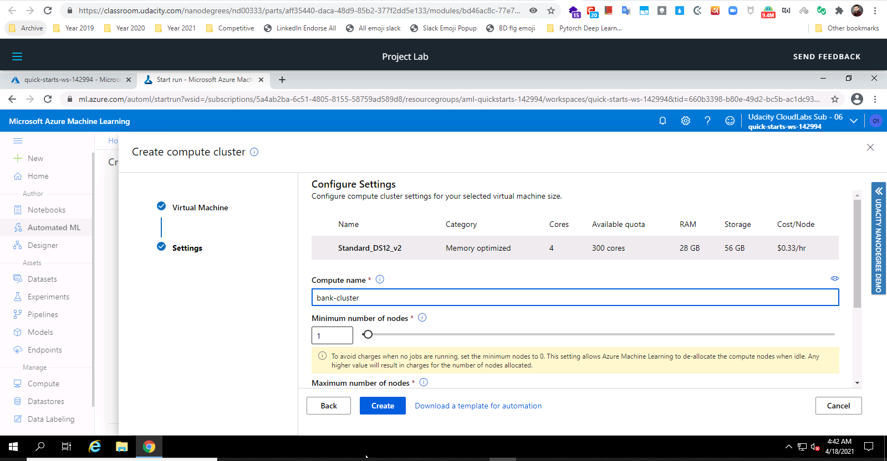
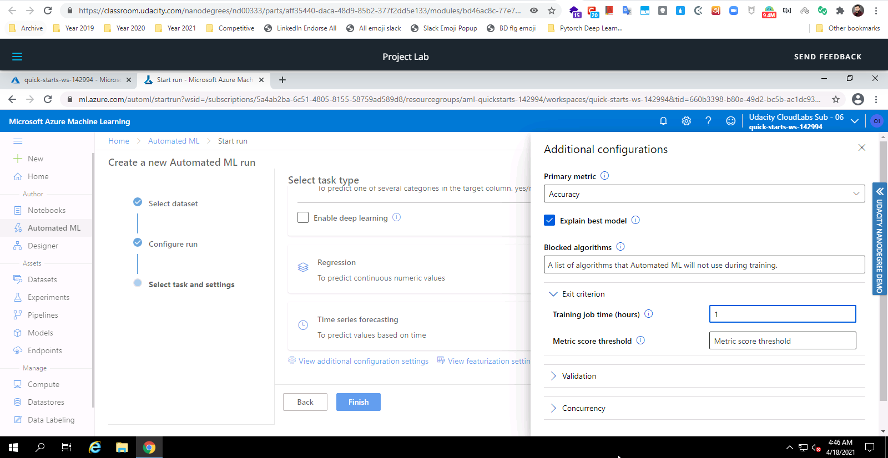
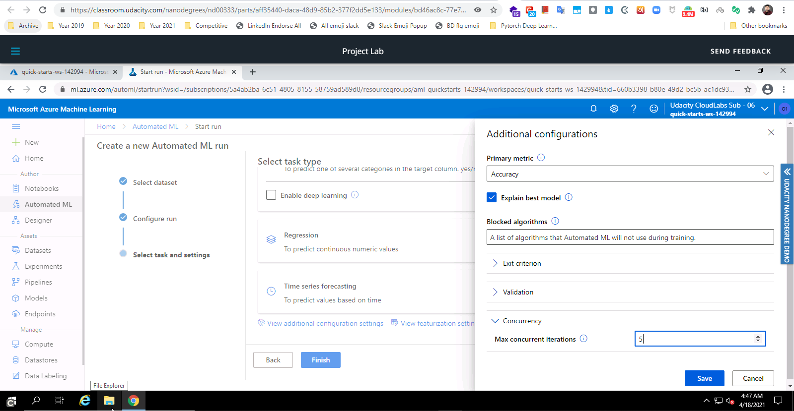
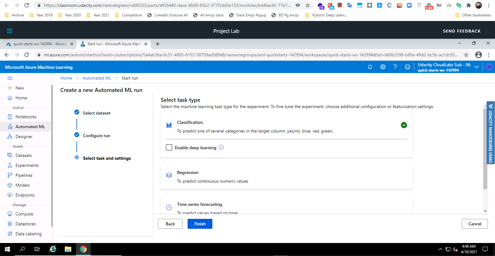
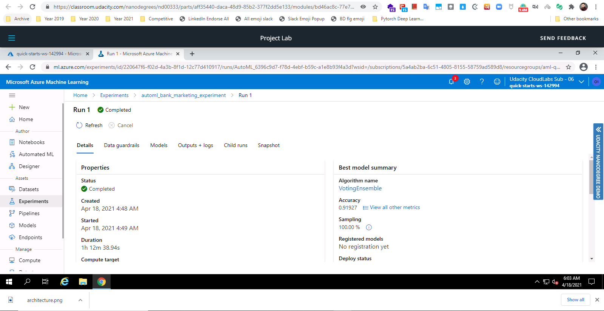
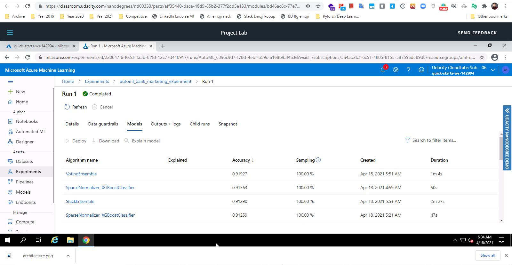
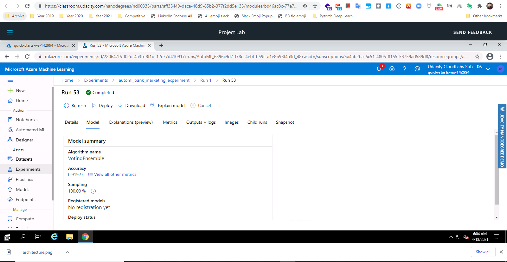
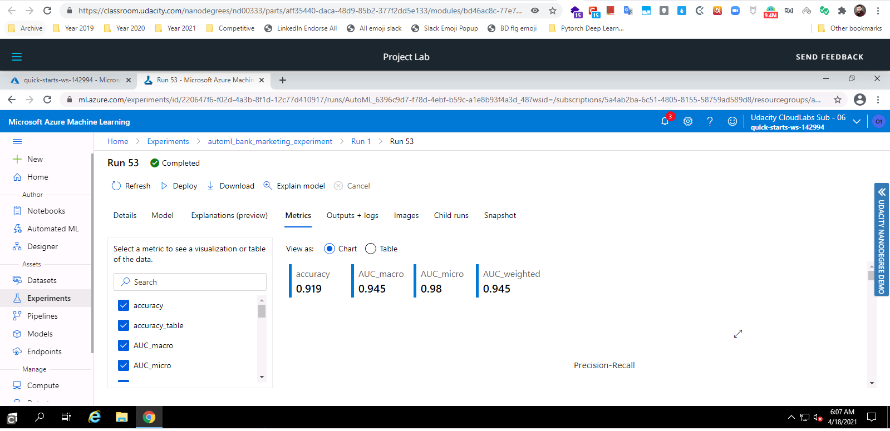

# Operationalizing Machine Learning in Microsoft Azure

In this project,I will continue to work with the `Bank Marketing dataset`. I will use Azure to configure a cloud-based machine learning production model, deploy it, and consume it. I will also create, publish, and consume a pipeline.

## Project Main Steps

In this project, I will be following the below steps:
- Authentication
- Automated ML Experiment
- Deploy the best model
- Enable logging
- Swagger Documentation
- Consume model endpoints
- Create and publish a pipeline
- Documentation

## Architecture Design 

## Future Improvements

Future Improvements can be done on data imbalance problem which was marked on the `Data Guardrails` of Runs. 

## Steps

### Authentication

As I am using the lab, Udacity provided to me, I am not authorized to create a security principal and so I skipped this step.

### Automated ML Experiment

In this step, I will create an experiment using Automated ML, configure a compute cluster, and use that cluster to run the experiment. 

What I am doing here is

- Creating an automl run with registered `Bank Marketing` dataset
- Creating a new compute cluster with VM STANDARD_DS12_V2 and minimum number of nodes 1
- Running the experiment with classification where Explain Best Model is enabled, Exit Criterion is default to 1 and Concurrency default to 5.

## Deploy the best model

After the experiment run completes, a summary of all the models and their metrics are shown, including explanations. The Best Model will be shown in the Details tab. In the Models tab, it will come up first (at the top). I am going to select the best model for deployment.

Deploying the Best Model will allow to interact with the HTTP API service and interact with the model by sending data over POST requests.

What I am doing here is

- Selecting the best model for deployment
- Deploying the model with authentication enabled and with Azure Container Instances (ACI)

## Enable logging and application insights

Now that the Best Model is deployed, enable Application Insights and retrieve logs. Although this is configurable at deploy time with a check-box, it is useful to be able to run code that will enable it for you.

What I am doing here is

- Executing `logs.py` file to enable logging and application insights

## Swagger Documentation

In this step, I will consume the deployed model using Swagger to view and understand request and response payload

What I am doing here is

- Executing `swagger.sh` to run swagger server
- Serving deployed model's `swagger.json` via `serve.py` to demonstrate HTTP API endpoints and payloads

## Consume model endpoints

Once the model is deployed, using the `endpoint.py` script provided to interact with the trained model. In this step, I will run the script, modifying both the `scoring_uri` and the `key` to match the key for my service and the URI that was generated after deployment.

What I am doing here is

- Modifying the script and executing it

It is an optional step. I want to load-test my model

What I am doing here is

- using `data.json` generated by `endpoint.py` file and apache load balancer tool `ab` to load test my model and check the performance measure, this is basically the benchmarking process

## Create and publish a pipeline

Here I am  using the Jupyter Notebook provided in the starter files. I am updating the notebook to have the same keys, URI, dataset, cluster, and model names already created. 

What I am doing here is

- Creating pipelines through azure ml python sdk
- Showing pipeline and published pipeline runs, best models and its performances etc

## Screencast

Here is my screen cast video uploaded on Youtube - [link](https://youtu.be/385CrB2Di5Y)

